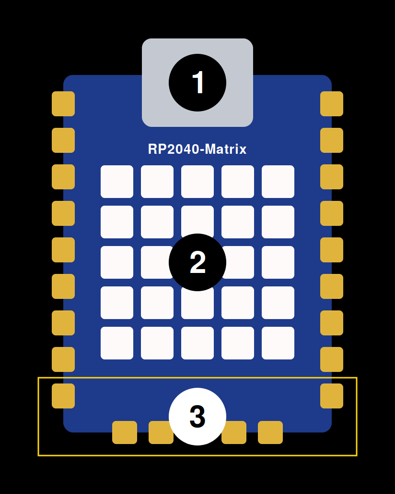
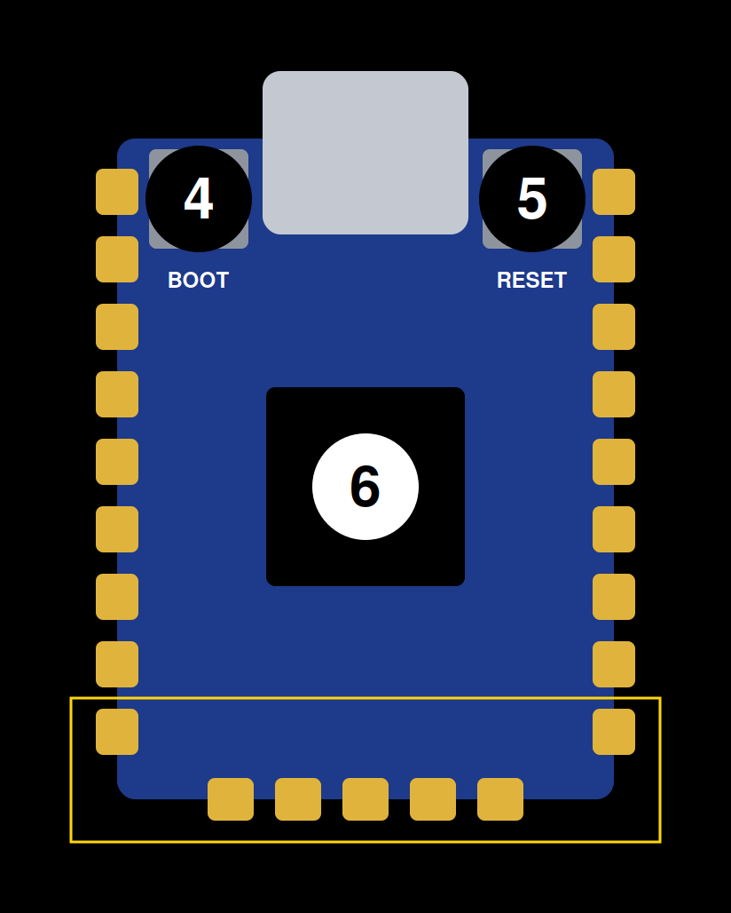
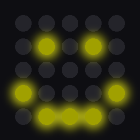

# RP2040-Matrix Apps

**Little apps for a little 5×5 LED computer**

Plug it into a USB port and it starts by itself.

This project runs on the [Waveshare RP2040-Matrix](https://www.waveshare.com/rp2040-matrix.htm), a development board by Waveshare built around the [Raspberry Pi RP2040](https://pip-assets.raspberrypi.com/categories/814-rp2040/documents/RP-008371-DS-1-rp2040-datasheet.pdf) microcontroller.

## The board

| Front | Back |
|:---:|:---:|
|  |  |

| # | Description |
|---|---|
| 1 | USB Type-C connector |
| 2 | 5×5 RGB LED Matrix |
| 3 | Touch pads (GP8–GP14) |
| 4 | BOOT button |
| 5 | RESET button |
| 6 | RP2040 dual-core processor |

## Controls

| Control | Description |
|---|---|
| Touch pads (GP8–GP14) | Touch the pads inside the yellow outline to control apps that react to touch. |
| BOOT button | Press to switch to the next app; after the last one it starts over. |
| RESET button | Press to restart the board; it comes back on the same app. |

## Apps

Press BOOT to step through the apps in this order.

| Name | Description | Preview |
|---|---|---|
| avatar | Little patterns like GitHub avatars |  |
| count | Counts 0 to 9 |  |
| dice | Touch to roll, touch again to stop |  |
| emoji | Touch to change the face |  |
| eyes | A face that raises its eyebrows |  |
| flag | Touch to raise the red flag |  |
| heart | A beating heart |  |
| life | Conway's Game of Life, a new random start each time |  |
| name | Spells a name in random colours |  |
| rain | Falling green digital rain |  |
| stars | Twinkling stars |  |

## Developers

This repo is built to be used with an AI coding agent that supports [Agent Skills](https://agentskills.io), such as GitHub Copilot. You also need macOS, the board and a USB Type-C data cable.

```bash
git clone https://github.com/adob71/rp2040-matrix-apps.git && cd rp2040-matrix-apps
```

Open your agent in the folder and ask for what you want. It picks the matching skill:

| Say | Skill |
|---|---|
| "Set up my computer for this repo" | `rp2040-matrix-setup` |
| "Deploy to my board" | `rp2040-matrix-deploy` |
| "Add an app that shows a traffic light" | `rp2040-matrix-add-app` |

No AI coding agent? The skills in `.agents/skills/` are plain step-by-step instructions you can follow by hand.

## License

MIT. See [LICENSE](LICENSE).

Waveshare and Raspberry Pi are trademarks of their respective owners. This is an independent project, not affiliated with or endorsed by either company.
