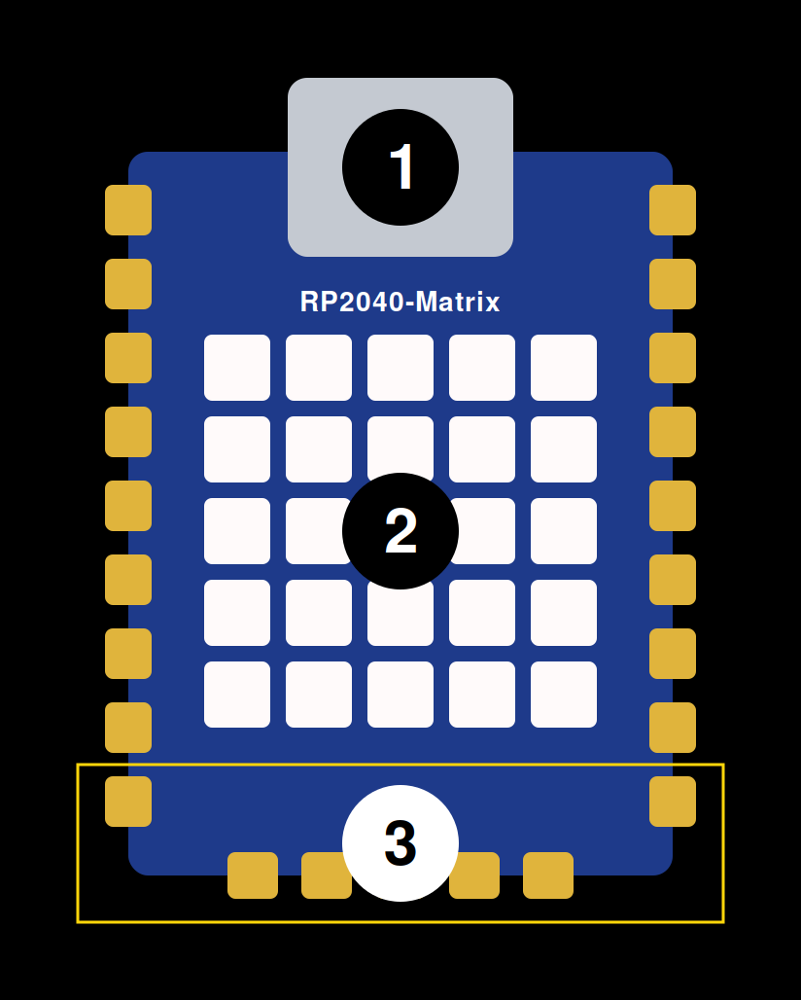
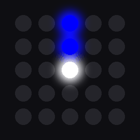
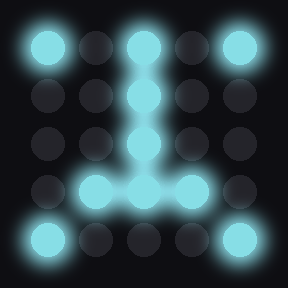

# RP2040-Matrix Apps

Little apps for a little LED matrix computer

Plug it in and it runs.

This project runs on the [Waveshare RP2040-Matrix](https://www.waveshare.com/rp2040-matrix.htm), a development board built around the [Raspberry Pi RP2040](https://www.raspberrypi.com/products/rp2040/) microcontroller.

## Development Board

| Front | Back |
|:---:|:---:|
|  |  |

| # | Description |
|---|---|
| 1 | USB Type-C connector |
| 2 | 5×5 RGB LED matrix |
| 3 | Touch pads (GP8–GP14) |
| 4 | BOOT button |
| 5 | RESET button |
| 6 | RP2040 dual-core processor |

## Controls

| Control | Description |
|---|---|
| Touch pads (GP8–GP14) | Touch the pads inside the yellow outline to control apps that react to touch. |
| BOOT button | Press to switch to the next app; after the last one it starts over. |
| RESET button | Press to restart the board; it starts again on the same app. |

## Apps

Press BOOT to step through the apps in this order.

| Name | Description | Preview | Demo |
|---|---|---|---|
| clock | Analog clock with hour and minute hands |  | [▶️](demo/clock.gif) |
| dice | Touch to roll a die, touch again to stop |  | |
| emoji | Touch to cycle through emoji faces |  | |
| eyes | Animated eyes that raise their eyebrows |  | |
| flag | Touch to raise and lower the red flag |  | |
| heart | Beating heart animation |  | [▶️](demo/heart.gif) |
| identicon | Touch to cycle through identicons |  | |
| life | Game of Life from a random start |  | |
| name | Spells a custom name in random colors |  | [▶️](demo/name.gif) |
| rain | Falling green digital rain, Matrix-style |  | [▶️](demo/rain.gif) |

## Developers

This repo is built to be used with an AI coding agent that supports [Agent Skills](https://agentskills.io). The skills have been tested using GitHub Copilot CLI, OpenAI Codex CLI and Cursor Agent CLI.

You also need a Mac, an RP2040-Matrix board and a USB Type-C data cable.

```bash
git clone https://github.com/adob71/rp2040-matrix-apps.git && cd rp2040-matrix-apps
```

Open your agent in the folder and ask for what you want. It picks the matching skill:

| Prompt | Skill |
|---|---|
| Set up my computer for this repo | `rp2040-matrix-setup` |
| Deploy to my board | `rp2040-matrix-deploy` |
| Add an app that shows a traffic light | `rp2040-matrix-add-app` |

No AI coding agent? The skills in `.agents/skills/` are plain step-by-step instructions you can follow by hand.

## License

MIT. See [LICENSE](LICENSE).

Waveshare and Raspberry Pi are trademarks of their respective owners. This is an independent project, not affiliated with or endorsed by either company.

The [RP2040 datasheet](docs/rp2040-datasheet.pdf) is © Raspberry Pi Ltd, licensed under [CC BY-ND 4.0](https://creativecommons.org/licenses/by-nd/4.0/) and included unmodified. The [RP2040-Matrix schematic](docs/rp2040-matrix-schematic.pdf) is published by Waveshare.
